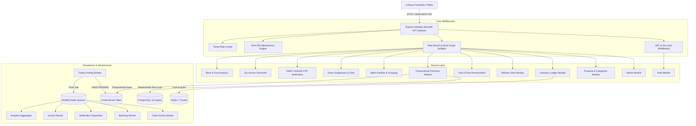

# QuickBlink — System Architecture & Concurrency Blueprint

This document details the software architecture, modular monolith domain boundaries, database transaction ordering, Redis distributed lock mechanisms, and event outbox asynchronous processing.

---

## 1. High-Level Modular Monolith Architecture



---

## 2. Deterministic Lock Ordering Invariant

To strictly prevent deadlocks and race conditions during high-volume flash-sales, the checkout transaction follows a strict deterministic acquisition sequence:

```
Step 1: Row Lock DeliverySlot
        SELECT * FROM "DeliverySlot" WHERE id = $1 FOR UPDATE;
        Verify slot.bookedCount < slot.capacity. Increment bookedCount.

Step 2: Row Lock Inventory Records in Ascending Product ID Order
        SELECT * FROM "Inventory" 
        WHERE storeId = $1 AND productId IN (...)
        ORDER BY productId ASC
        FOR UPDATE;
        Verify availableQuantity >= requested. Decrement availableQuantity, increment reservedQuantity.

Step 3: Insert Order & OrderItems Snapshot
        Insert Order with immutable addressSnapshot & pricing breakdown.

Step 4: Generate & Insert DeliveryOTP
        Generate cryptographic 6-digit OTP, hash using HMAC-SHA256, insert DeliveryOTP record.

Step 5: Write OutboxEvent
        Insert OutboxEvent with ORDER_PLACED payload inside the same atomic database transaction.
```

---

## 3. Safe Redis Distributed Lock Protocol

When mutating global slots or driver status across distributed processes, Redis distributed locks are acquired using a safe unique token and released via atomic Lua script:

```lua
-- Lua script for atomic safe lock release
if redis.call("get", KEYS[1]) == ARGV[1] then
    return redis.call("del", KEYS[1])
else
    return 0
end
```

This guarantees that a slow worker will never inadvertently release a lock acquired by another concurrent worker after TTL expiry.

---

## 4. Multi-Tenant Store Data Isolation

Dark store operators (`STORE_ADMIN`, `STORE_STAFF`) are scoped strictly to their assigned dark store via `requireStoreScope('storeId')` middleware. Cross-store queries or mutations automatically reject with `403 FORBIDDEN`. `SUPER_ADMIN` holds platform-wide bypass authority.
